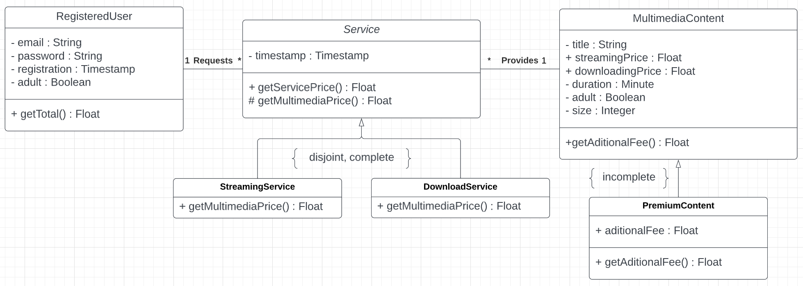

# React Meetup

To start the project:

1. `git clone https://github.com/xup3rr/react-meetup`
2. `yarn` or `npm install`, wait till the instalation finish
3. `yarn start` or `npm start`

This project was bootstrapped with [Create React App](https://github.com/facebook/create-react-app).

### Available Scripts

In the project directory, you can run:

`npm start` (Run the app in the development mode. Open [http://localhost:3000](http://localhost:3000) to view it in your browser.)

`npm test` (Launches the test runner in the interactive watch mode.)

`npm run build` (Builds the app for production to the **build** folder.)

### Packages

"react-router-dom": "^6.4.2" (Navegar entre las paginas, reflejado el cambio en la url para mejorar el SEO)

"react-hook-form": "^7.38.0" (Gestion y validacion de formularios)

"jotai": "^1.8.6", (Gestion de estados globales) `MeetupAtom` contiene todos los meetups del muck api call asi como los que se van adicionando desde el formulario. `MeetupFavoriteAtom` guarda los meetups selecionados como favoritos (se adicionan o eliminan al hacer click en su respectivo botton dentro de cada MeetupItem)

---

# Technical Test

Teniendo como premisa este modelo, se detecta un problema de escalabilidad, el cual rompe con los principios SOLID. Si se agrega otro tipo de Servicio habría que modifical el modelo. Todo módulo deben estar abierto para extensión pero cerrado para modificación (principio open close).

Para solucionarlo, propongo el siguiente Diagrama y correspondiente Pseudocódigo.



La clase RegisteredUser itera sobre todos sus servicios sumando el precio de los mismos (service.getServicePrice)

Dentro de la clase Service el método getServicePrice suma el precio de su MultimediaContent. Al ser una clase abstract esta nunca se llega a instanciar. this.getMultimediaPrice se implementa en las clases hijas y retorna su precio correspondiente (StreamingService , DownloadService).

Adicionar el método getMultimediaPrice a la clase abstracta Service el cual sera implementado en cada una de sus clases hijas (StreamingService , DownloadService).

Para el AditionalFee, dentro de la clase MultimediaContent, este método siempre retorna 0. Dentro de la clase PremiumContent se sobreescribe (override) retornando el fee de contenido premium.

```js
class RegisteredUser {
  constructor(services = []) {
    this.services = services;
  }

  public getTotal() {
    let total = 0;
    this.services.forEach((service,index) => {
      total += service.getServicePrice();
    });
    return total;
  }
}

abstract class Service{
  MultimediaContent content;

  public getServicePrice() {
    return this.getMultimediaPrice() + content.getAditionalFee();
  }

  abstract float getMultimediaPrice();
}

//same with DownloadService (return downloadPrice)
class StreamingService is Service {
  protected override float getMultimediaPrice() {
    return content.streamingPrice;
  }
}

class MultimediaContent {
  public float getAditionalFee()   {
    return 0;
  }
}

public class PremiumContent is MultimediaContent {
  private float additionalFee;
  public override float getAditionalFee() {
    return additionalFee;
  }
}

```
